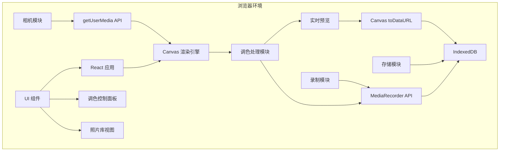
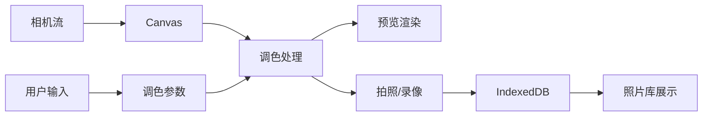
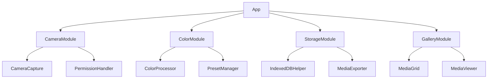
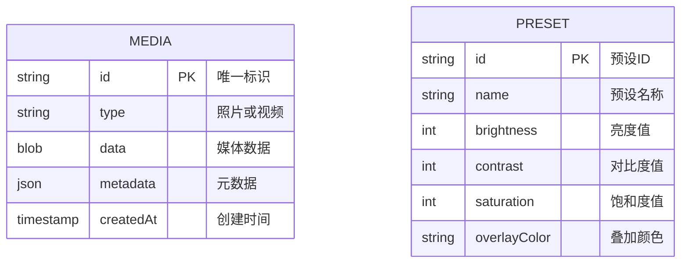

# 技术架构文档 - 实况调色相机

## 1. 架构设计



## 2. 技术描述

### 2.1 前端技术栈
- **框架**: React 18 + TypeScript
- **构建工具**: Vite 5
- **样式方案**: Tailwind CSS 3
- **状态管理**: React Hooks (useState, useEffect, useRef)
- **路由**: React Router 6

### 2.2 核心依赖
- **Canvas API**: 用于实时渲染和调色处理
- **WebRTC API**: 用于访问摄像头（getUserMedia）
- **MediaRecorder API**: 用于录制视频
- **IndexedDB API**: 用于本地存储照片和视频

### 2.3 关键技术实现
#### 调色算法
```typescript
// 核心调色流程
function renderFrame(video: HTMLVideoElement, canvas: HTMLCanvasElement) {
  const ctx = canvas.getContext('2d');

  // 1. 绘制原始视频帧
  ctx.drawImage(video, 0, 0);

  // 2. 应用亮度/对比度/饱和度调整
  ctx.filter = `brightness(${brightness}%) contrast(${contrast}%) saturate(${saturation}%)`;
  ctx.drawImage(video, 0, 0);

  // 3. 叠加柔光效果层
  ctx.globalCompositeOperation = 'soft-light';
  ctx.fillStyle = overlayColor; // 根据调色参数生成
  ctx.fillRect(0, 0, canvas.width, canvas.height);

  // 4. 重置混合模式
  ctx.globalCompositeOperation = 'source-over';
}
```

#### 录像实现
```typescript
// 使用 MediaRecorder 录制调色后的 Canvas
const stream = canvas.captureStream(30); // 30fps
const mediaRecorder = new MediaRecorder(stream, {
  mimeType: 'video/webm;codecs=vp9'
});
```

### 2.4 数据流架构


## 3. 路由定义

| 路由 | 用途 |
|-----|------|
| `/` | 主页面：相机预览和调色控制 |
| `/gallery` | 照片库页面：查看已保存的媒体 |

## 4. 模块设计

### 4.1 核心模块划分



### 4.2 模块职责

#### CameraModule（相机模块）
- `CameraCapture`: 管理相机流的生命周期
- `PermissionHandler`: 处理相机权限请求和错误

#### ColorModule（调色模块）
- `ColorProcessor`: 核心 Canvas 渲染和调色算法
- `PresetManager`: 管理调色预设效果

#### StorageModule（存储模块）
- `IndexedDBHelper`: IndexedDB 的 CRUD 操作封装
- `MediaExporter`: 照片和视频的导出功能

#### GalleryModule（照片库模块）
- `MediaGrid`: 媒体网格展示组件
- `MediaViewer`: 大图查看和操作组件

## 5. 数据模型

### 5.1 数据实体关系



### 5.2 数据结构定义

```typescript
// 媒体对象
interface Media {
  id: string;
  type: 'photo' | 'video';
  data: Blob;
  metadata: {
    width: number;
    height: number;
    duration?: number; // 仅视频
    createdAt: number;
  };
  createdAt: number;
}

// 调色预设
interface ColorPreset {
  id: string;
  name: string;
  brightness: number; // 0-200
  contrast: number; // 0-200
  saturation: number; // 0-200
  overlayColor: string;
}

// 调色参数
interface ColorParams {
  brightness: number; // 默认 100
  contrast: number; // 默认 100
  saturation: number; // 默认 100
}
```

## 6. 性能优化策略

### 6.1 渲染优化
- 使用 `requestAnimationFrame` 控制渲染循环
- Canvas 尺寸与视频分辨率匹配，避免缩放
- 使用 CSS `will-change` 优化动画性能

### 6.2 内存管理
- 录像时使用 Blob 流式写入，避免内存占用过大
- 照片库使用虚拟滚动，仅渲染可见区域的缩略图
- 及时清理不再使用的 Canvas 上下文

### 6.3 IndexedDB 优化
- 创建 `createdAt` 索引，加速按时间排序查询
- 使用事务批量插入媒体数据
- 缩略图单独存储，减少大图加载

## 7. 错误处理

### 7.1 相机权限错误
- 用户拒绝：显示友好的提示和重新请求按钮
- 设备无相机：显示错误信息并提供替代方案
- 相机占用：提示用户关闭其他应用

### 7.2 浏览器兼容性
- 检测 API 支持：getUserMedia、MediaRecorder、IndexedDB
- 不支持时显示降级提示

### 7.3 存储空间不足
- 录像时监测可用空间
- 接近上限时提示用户清理照片库

## 8. 安全考虑

### 8.1 数据安全
- 所有数据仅存储在用户设备本地
- 不涉及网络传输，无需担心数据泄露
- 清除浏览器数据时，照片和视频也会被删除

### 8.2 权限控制
- 仅请求相机权限，无需其他权限
- 录像和拍照功能完全在本地执行