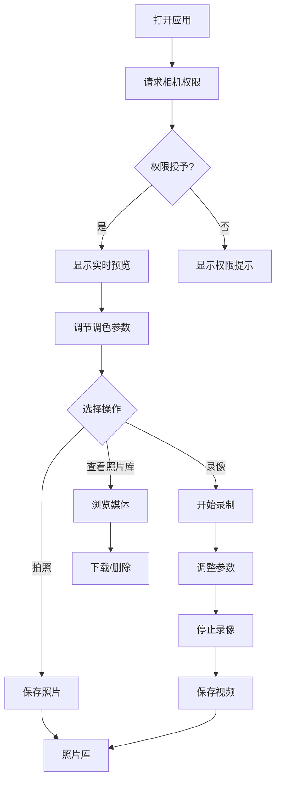

# 产品需求文档 - 实况调色相机

## 1. 产品概述

纯前端网页版实况调色相机应用，通过 Canvas 实时处理相机画面，使用「柔光」混合模式叠加调色效果，提供亮度/对比度/饱和度调节功能，支持拍照和录像并保存到本地。

* **目标用户**：摄影爱好者、内容创作者、社交媒体用户

* **核心价值**：无需安装应用，手机浏览器直接打开即可使用，实时预览调色效果，拍照录像一键保存

## 2. 核心功能

原始调色：柔光黑色混合模式

### 2.1 用户角色

无需注册，所有用户均可直接使用全部功能。

### 2.2 功能模块

1. **主页面**：相机实时预览、调色参数控制、拍照/录像操作
2. **照片库页面**：查看已拍摄的照片和视频、下载、删除

### 2.3 页面详情

| 页面名称  | 模块名称   | 功能描述             |
| ----- | ------ | ---------------- |
| 主页面   | 相机预览区  | 实时显示调色后的相机画面     |
| 主页面   | 调色控制面板 | 亮度、对比度、饱和度滑块调节   |
| 主页面   | 操作按钮区  | 拍照、录像、查看照片库按钮    |
| 主页面   | 预设效果选择 | 提供多种调色预设效果快速切换   |
| 照片库页面 | 媒体列表   | 网格展示已保存的照片和视频缩略图 |
| 照片库页面 | 媒体操作   | 查看大图/播放视频、下载、删除  |

## 3. 核心流程

### 3.1 拍照流程

用户打开应用 → 浏览器请求相机权限 → 相机画面实时显示在 Canvas 上 → 用户调节调色参数实时预览效果 → 点击拍照按钮 → 应用调色效果保存照片到本地存储 → 照片出现在照片库中

### 3.2 录像流程

用户点击录像按钮 → 开始录制调色后的视频画面 → 用户可实时调整调色参数 → 点击停止录像 → 视频保存到本地存储 → 视频出现在照片库中

### 3.3 流程图

## 4. 用户界面设计

### 4.1 设计风格

* **主题风格**：专业摄影工具风格，深色主题为主，突出画面内容

* **主色调**：深灰黑色背景（#1a1a1a），橙色作为主要强调色（#ff6b35）

* **次要色**：白色文字、灰色边框、半透明控制面板

* **按钮风格**：圆角按钮，拍照按钮为大型圆形按钮，强调视觉焦点

* **字体**：

  * 标题：SF Pro Display / -apple-system（系统字体，粗体）

  * 正文：SF Pro Text / -apple-system（系统字体，常规）

  * 数字参数：SF Mono（等宽字体）

* **布局风格**：全屏相机预览，底部浮动控制面板，顶部半透明状态栏

* **图标风格**：线性图标，简洁现代，iOS 风格

### 4.2 页面设计概览

| 页面名称  | 模块名称   | UI 元素                                    |
| ----- | ------ | ---------------------------------------- |
| 主页面   | 相机预览区  | 全屏 Canvas，深色背景，实时显示调色效果                  |
| 主页面   | 状态栏    | 半透明黑色背景，显示当前时间、电量、录制状态                   |
| 主页面   | 调色控制面板 | 底部浮动卡片，毛玻璃效果，三个垂直滑块（亮度/对比度/饱和度），参数数值显示   |
| 主页面   | 预设效果选择 | 横向滚动列表，预设缩略图，当前选中高亮                      |
| 主页面   | 操作按钮区  | 底部居中，大型圆形拍照按钮（白色圆环，橙色中心），左右两侧为相册和切换摄像头按钮 |
| 照片库页面 | 媒体列表   | 网格布局，3列，照片/视频缩略图，视频带播放图标                 |
| 照片库页面 | 媒体操作   | 大图查看模式，下载/删除按钮，关闭按钮                      |

### 4.3 响应式设计

* **移动优先**：针对手机竖屏设计（9:16 比例）

* **触摸优化**：所有交互元素最小触摸区域 44px，滑块高度适配手指操作

* **全屏适配**：相机预览自动填充屏幕，控制面板固定在底部

* **横屏适配**：横屏时控制面板移至右侧，保持相机预览最大化

### 4.4 动画效果

* **页面进入**：淡入效果，控制面板从底部滑入

* **拍照反馈**：快门动画（白色闪光），按钮缩放效果

* **录制指示**：录制按钮闪烁红点，状态栏显示录制时间

* **滑块调节**：实时反馈，无延迟感

* **预设切换**：平滑过渡动画

## 5. 技术约束

### 5.1 浏览器兼容性

* Chrome 80+、Safari 14+、Firefox 78+、Edge 80+

* 需要支持 MediaDevices API（getUserMedia）

* 需要支持 Canvas globalCompositeOperation: soft-light

* 需要支持 MediaRecorder API（录像功能）

### 5.2 性能要求

* 相机预览帧率：≥ 30fps

* 调色参数调整延迟：< 16ms（60fps）

* 照片保存速度：< 500ms

* 视频编码：实时编码，无卡顿

### 5.3 存储限制

* 使用 IndexedDB 存储照片和视频

* 单个视频文件大小限制：100MB

* 总存储容量：浏览器默认限制（通常为磁盘空间的 50%）

## 6. 未来扩展

* 云端同步功能

* 更多调色预设效果

* 社交分享功能

* 人像模式、景深效果

* RAW 格式导出

